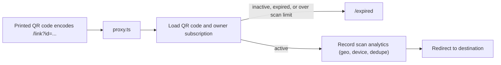

# QR Leaper

QR Leaper is a full-stack SaaS application for **dynamic QR codes** - QR codes whose destination can be changed after they have been printed. Users design branded codes, point them at links, files, SMS, email, social profiles, or digital business cards (vCards), and track every scan with device and location analytics.

Built with the Next.js App Router, TypeScript, Drizzle ORM on Postgres (Neon), NextAuth v5, Stripe subscriptions, AWS S3, and Resend.

## Why this project exists

A static QR code has its payload baked in at print time, so changing the destination means reprinting the code. QR Leaper separates the printed code from its content:

- Every QR code encodes a stable URL (`/link?id=<id>`), not the final destination.
- A Next.js proxy handler resolves the current destination at scan time and redirects.
- That indirection makes codes editable after printing, lets codes be deactivated (expired subscription, plan downgrade, free-tier scan cap) without reprinting, and provides a single choke point for recording analytics.
- A subscription layer (Free / Starter / Plus / Pro via Stripe) puts limits on how many active codes an account can have and how many scans free codes can serve.

The result is a complete, self-contained example of a subscription-based web application: authentication, billing, quotas, object storage, email, and analytics implemented end to end.

## Features

- **Dynamic QR codes** - nine types defined by a database enum: `link`, `file`, `message`, `email`, `instagram`, `facebook`, `youtube`, `googleDoc`, and `vcard`.
- **Visual designer** - colors with linear/radial gradients and rotation, square or circular shapes, optional frames with top/bottom captions, and logo embedding.
- **Exports** - PNG, JPEG, SVG, and WEBP via `qr-code-styling`, plus PDF rendering with `jspdf`.
- **Editable code content** - the destination and style of a saved code can be changed from the dashboard; the printed `/link?id=...` URL never changes.
- **Files behind QR codes** - upload PDFs and images (S3 presigned uploads) and serve them through a streaming proxy endpoint with HTTP range support.
- **Digital business cards** - vCard builder with profile photo, gallery, contact fields, and social links; four visual templates; a public page at `/vcard/<username>`; and one-click `.vcf` download generated with `vcards-js`.
- **Scan analytics** - per-scan records of country, city, region, continent, device type/vendor/model, browser, and IP; deduplicated per device via a SHA-256 identity hash; visualised with Recharts charts and a Leaflet world map, filterable by date range.
- **Subscriptions and quotas** - Stripe Checkout, Billing Portal, webhook-driven state sync, per-plan QR code limits, and a 500-scan cap on the free tier enforced at redirect time.
- **Authentication** - NextAuth v5 with Google OAuth, email magic links (Resend), and email/password credentials, including OTP-based registration and token-based password reset.

## How it works

### Architecture overview



### The redirect pipeline

All dynamic codes resolve through the same path:

1. **`/link?id=<id>`** (and **`/vcard/<username>`**, which first resolves the slug to a QR code id) is intercepted by `proxy.ts`.
2. The proxy loads the QR code and the owner's subscription. Inactive codes, lapsed subscriptions, and free-tier codes past 500 scans are redirected to `/expired` instead of the destination.
3. Each scan is recorded: the device is identified by a SHA-256 hash of user agent + IP, repeat scans increment a `count` on the existing analytics row, and geo data comes from Vercel request headers (`@vercel/functions`). A separate `qr_scan_count` table keeps a running total per code.
4. The request is redirected to the stored endpoint. For `mailto:` and `sms:` codes - where a 302 is unreliable - an HTML meta-refresh page is returned instead.

Because `proxy.ts` always runs on the Node.js runtime in Next.js 16, the redirect pipeline can query the database and send mail directly.

### Application structure

- **Server components** load data and perform redirects; **server actions** perform all mutations.
- Actions are built with `next-safe-action` and validated with Zod schemas shared with the client forms. Two action clients exist: an anonymous one and an authenticated one that injects the session user (`lib/action/safe-action.ts`).
- Guard middlewares wrap actions: `throwSubscriptionError` (checks subscription validity and plan limits, used by all create actions), `throwSubscriptionEditError` (validity only, used by edit actions), and ownership/username guards for QR codes and vCard slugs.
- Creating a code runs a single Drizzle transaction that inserts the base `qr_code` row, the type-specific payload row, and the style row, then increments the subscription's usage count.
- File uploads never pass through the app server: the client requests a presigned PUT URL (60-second expiry) from a server action and uploads directly to S3. Downloads are proxied through `GET /api/view`, which supports range requests and content disposition.

### Data model

Drizzle schema lives in `database/schema/` (PostgreSQL enums for QR status, gradient type, and QR type):

| Table(s)                                                                                                                                                                | Purpose                                                                                                 |
| ----------------------------------------------------------------------------------------------------------------------------------------------------------------------- | ------------------------------------------------------------------------------------------------------- |
| `user`, `account`, `authenticator`, `verificationToken`, `passwordResetToken`, `emailChangeToken`                                                                       | Authentication (NextAuth Drizzle adapter plus two custom token tables for OTP and password reset flows) |
| `qr_code`                                                                                                                                                               | Core record: owner, title, type, status (`active`/`inactive`), and resolved endpoint                    |
| `qr_code_style`                                                                                                                                                         | Colors, gradient type/rotation, shape, frame, captions, and logo                                        |
| `qr_code_link`, `qr_code_file`, `qr_code_message`, `qr_code_email`, `qr_code_instagram`, `qr_code_facebook`, `qr_code_youtube`, `qr_code_google_doc`, `qr_virtual_card` | Type-specific payloads, one row per code (vCard stores the full profile and its unique `userName` slug) |
| `qr_analytics`                                                                                                                                                          | One row per code/device pair with geo and device metadata and a scan `count`                            |
| `qr_scan_count`                                                                                                                                                         | Running total of scans per code (unique per code)                                                       |
| `subscription`                                                                                                                                                          | Stripe customer/subscription IDs, current period end, and the plan usage counter                        |

A single generated migration (`drizzle/0000_nappy_famine.sql`) contains the full initial schema.

## Tech stack

| Layer                  | Technology                                         | Notes                                                                                                                                                                              |
| ---------------------- | -------------------------------------------------- | ---------------------------------------------------------------------------------------------------------------------------------------------------------------------------------- |
| Framework              | Next.js 16 (App Router), React 19                  | Server components for data fetching, server actions for mutations                                                                                                                  |
| Language               | TypeScript 7                                       | Strict mode; shared types across client and server                                                                                                                                 |
| Database               | PostgreSQL (Neon serverless driver)                | Drizzle ORM + drizzle-kit migrations                                                                                                                                               |
| Auth                   | NextAuth.js v5 (beta)                              | Google, Resend magic link, and credentials providers; JWT sessions; Drizzle adapter. Providers, callbacks, and events live in `auth.config.ts`; `auth.ts` adds the Drizzle adapter |
| Payments               | Stripe                                             | Checkout, Billing Portal, and webhook-driven subscription sync                                                                                                                     |
| Storage                | AWS S3                                             | Presigned uploads, streamed downloads via `/api/view`                                                                                                                              |
| Email                  | Resend + React Email                               | Auth links, OTP codes, and expiry/limit notifications                                                                                                                              |
| UI                     | Tailwind CSS, shadcn/ui, Radix UI, lucide-react    | Pages under `app/` compose components from `components/`                                                                                                                           |
| QR rendering           | `qr-code-styling` + custom frame extension         | `components/package/qr-code/`                                                                                                                                                      |
| Charts and maps        | Recharts, Leaflet / react-leaflet                  | Analytics dashboard                                                                                                                                                                |
| Validation and actions | Zod, `next-safe-action`                            | Schemas in `zod/`, actions in `app/actions/`                                                                                                                                       |
| Client state           | Zustand, react-hook-form                           | UI state stores in `hooks/`; form state persisted to localStorage for the designer                                                                                                 |
| Tooling                | Bun, oxlint, oxfmt, Husky, lint-staged, commitlint | See Development below                                                                                                                                                              |

## Getting started

### Prerequisites

- [Bun](https://bun.sh) 1.3+ (the project is pinned to `bun@1.3.11` in `package.json`)
- [Node.js](https://nodejs.org) 20.9 or newer (required by Next.js 16)
- A PostgreSQL database reachable with the Neon serverless driver (e.g. a [Neon](https://neon.tech) project)
- A [Stripe](https://stripe.com) account with six recurring price IDs (Starter/Plus/Pro × monthly/yearly)
- An AWS S3 bucket and credentials for file uploads
- A [Resend](https://resend.com) API key for transactional email
- A Google OAuth client (optional - only needed for Google sign-in)

### Installation

```bash
git clone https://github.com/Nayanchandrakar/qrleaper.git
cd qrleaper
bun install
```

### Configuration

Copy the example environment file and fill in the values:

```bash
cp .env.example .env
```

The file groups variables by service and uses placeholder values to show the expected format:

```bash
# Environment setting
NODE_ENV=development

# Database (Neon.tech PostgreSQL)
DATABASE_URL="your_neon_database_url"

# Auth.js secret used to sign sessions and tokens
AUTH_SECRET="your_auth_secret"

# Public app URL (used to build QR endpoints, edit links, and email links)
NEXT_PUBLIC_APP_URL="http://localhost:3000"

# Server-side app URL (used for redirects and links inside emails)
APP_URL="http://localhost:3000"

# Trust forwarded host headers when self-hosting behind a proxy
AUTH_TRUST_HOST="true"

# Bearer token required by the cron API route
CRON_SECRET="your_cron_secret"

# Google OAuth credentials
AUTH_GOOGLE_ID="your_google_client_id"
AUTH_GOOGLE_SECRET="your_google_client_secret"

# Resend API key and the From address for outgoing email
RESEND_API_KEY="re_xxxxxxxxxxxxxxxxxxxxxxxx"
RESEND_MAIL="noreply@yourdomain.com"

# AWS S3 credentials and bucket for uploads and generated assets
AWS_ACCESS_KEY_ID="your_aws_access_key_id"
AWS_SECRET_ACCESS_KEY="your_aws_secret_access_key"
AWS_REGION="us-east-1"
S3_BUCKET="your_s3_bucket_name"

# Stripe server key and webhook signing secret
STRIPE_API_KEY="your_stripe_secret_key"
STRIPE_WEBHOOK_SECRET="whsec_xxxxxxxxxxxxxxxxxxxxxxxx"

# Starter plan price IDs
NEXT_PUBLIC_STRIPE_STARTER_MONTHLY_PLAN_ID="price_xxxxxxxxxxxxxxxxxxxxxxxx"
NEXT_PUBLIC_STRIPE_STARTER_YEARLY_PLAN_ID="price_xxxxxxxxxxxxxxxxxxxxxxxx"

# Plus plan price IDs
NEXT_PUBLIC_STRIPE_PLUS_MONTHLY_PLAN_ID="price_xxxxxxxxxxxxxxxxxxxxxxxx"
NEXT_PUBLIC_STRIPE_PLUS_YEARLY_PLAN_ID="price_xxxxxxxxxxxxxxxxxxxxxxxx"

# Pro plan price IDs
NEXT_PUBLIC_STRIPE_PRO_MONTHLY_PLAN_ID="price_xxxxxxxxxxxxxxxxxxxxxxxx"
NEXT_PUBLIC_STRIPE_PRO_YEARLY_PLAN_ID="price_xxxxxxxxxxxxxxxxxxxxxxxx"
```

The pricing page and quota enforcement are both driven by `constants/pages/pricing/pricing-data.ts` (display data) and `constants/pages/pricing/usage.ts` (per-plan limits used by the action guards):

| Plan    | Monthly | Yearly | QR code limit |
| ------- | ------- | ------ | ------------- |
| Free    | $0      | -      | 1             |
| Starter | $10     | $96    | 3             |
| Plus    | $30     | $300   | 50            |
| Pro     | $60     | $600   | 200           |

The Free tier additionally caps codes at 500 scans (enforced in the redirect proxy) and its pricing copy describes a 30-day trial with 30 days of analytics.

### Database setup

```bash
# Option A - apply the generated migration
bun db:migrate

# Option B - push the current schema directly (handy during prototyping)
bun db:push

# Inspect data in the browser
bun db:studio
```

### Running

```bash
bun dev     # http://localhost:3000
```

For local Stripe webhook testing, forward events to the app:

```bash
stripe listen --forward-to localhost:3000/api/webhooks/stripe
```

### Production build

```bash
bun build
bun start
```

## Usage

A typical session:

1. **Create a code** - open `/design` and pick a type (link, file, SMS, email, or a social/document target), or `/design/vcard` for a digital business card. Fill in the content, then style it (colors, gradient, shape, frame, logo) with a live preview.
2. **Download or share** - export the artwork as PNG/JPEG/SVG/WEBP/PDF, or copy the encoded `/link?id=...` URL. This URL is what gets printed; it never changes.
3. **Scan** - a scan hits the proxy, which records analytics and redirects to the current destination. vCard codes also expose a public profile at `/vcard/<username>` with an "add to contacts" `.vcf` download.
4. **Track** - `/dashboard/qr-codes` lists all codes with scan counts; `/dashboard/analytics/<id>` shows device, browser, country, and city breakdowns on charts and a world map, filterable by date range.
5. **Edit** - change the destination or styling from the dashboard (`/<id>/edit`); the printed code keeps working and simply points somewhere new.
6. **Manage billing** - `/pricing` starts a Stripe Checkout session or opens the Billing Portal for existing subscribers; `/dashboard/billing` shows plan status and cancellation state.

Route map:

| Route                                                                                                      | Description                                                                 |
| ---------------------------------------------------------------------------------------------------------- | --------------------------------------------------------------------------- |
| `/`                                                                                                        | Permanent redirect to `/design`                                             |
| `/design` + `/design/{file,message,email,instagram,facebook,youtube,google-docs,vcard}`                    | QR creation flows per type                                                  |
| `/solutions`, `/pricing`, `/expired`                                                                       | Public marketing and pricing pages                                          |
| `/login`, `/register`, `/forgot-password`, `/reset-password/[token]`                                       | Authentication                                                              |
| `/dashboard/qr-codes`                                                                                      | Paginated list of the user's codes                                          |
| `/dashboard/analytics/[id]`                                                                                | Per-code scan analytics                                                     |
| `/dashboard/billing`, `/dashboard/user-profile`                                                            | Billing portal and account settings                                         |
| `/[id]/edit` + per-type sub-routes                                                                         | Edit an existing code                                                       |
| `/link?id=<id>`                                                                                            | Dynamic redirect (handled entirely by proxy - no page component)            |
| `/vcard/<username>`                                                                                        | Public vCard slug (proxy resolves it to the link pipeline)                  |
| `/profile/vcard/[id]`                                                                                      | Rendered public vCard profile page                                          |
| `/api/auth/[...nextauth]`, `/api/webhooks/stripe`, `/api/view`, `/api/vcard`, `/api/cron/disposable-email` | Auth handler, Stripe webhook, file streaming, vCard download, scheduled job |

## Project structure

```
app/
  (home)/        Public pages: pricing, solutions, expired, rendered vCard profiles
  (auth)/        Login, registration with OTP, password reset
  (design)/      QR creation flows, one route per code type
  (edit)/        Per-type edit forms under [id]/edit
  (dashboard)/   Authenticated dashboard: qr-codes, analytics, billing, profile
  actions/       Server actions (next-safe-action + Zod), grouped by feature
  api/           NextAuth handler, Stripe webhook, file streaming, vCard download, cron
components/      UI primitives (shadcn/ui), feature components, QR renderer, charts, vCard templates
constants/       Pricing data and plan limits, navigation, form options, QR color presets
database/        Drizzle schema definitions and the Neon client
drizzle/         Generated SQL migrations and metadata
handlers/        Client-side form submit handlers
hooks/           Zustand stores, form persistence, download helpers
lib/             Auth config, Stripe client, mail helper, safe-action clients, utilities
middlewares/     Link resolution/redirect middleware and vCard slug resolver
templates/       React Email templates for auth and notification emails
utils/           URL builders, vCard generation, analytics aggregation helpers
zod/             Validation schemas shared between forms and server actions
routes.ts        Route lists and regexes consumed by proxy
proxy.ts         Auth-aware request routing and redirect pipeline entry point
```

## Development

### Scripts

| Command                                         | Purpose                                          |
| ----------------------------------------------- | ------------------------------------------------ |
| `bun dev`                                       | Start the development server                     |
| `bun build` / `bun start`                       | Production build and serve                       |
| `bun lint` / `bun lint:fix`                     | Run oxlint (with `--fix`)                        |
| `bun format` / `bun format:check`               | Run oxfmt (check-only mode with `--check`)       |
| `bun db:generate`                               | Generate a SQL migration from the Drizzle schema |
| `bun db:migrate`                                | Apply pending migrations                         |
| `bun db:push`                                   | Push the schema directly to the database         |
| `bun db:pull`, `bun db:export`, `bun db:studio` | Introspect, export, or browse the database       |

### Conventions and quality gates

- A Husky `pre-commit` hook runs `lint-staged`, which lints and formats staged files.
- Commit messages follow Conventional Commits (`commitlint.config.ts` defines the allowed types: `feat`, `fix`, `docs`, `chore`, and others).
- Formatting and linting are handled by oxfmt/oxlint rather than Prettier/ESLint; the rule set lives in `oxlint.config.ts` and `oxfmt.config.ts`.
- Validation schemas are shared: forms use the same Zod schemas as the server actions that receive them.

### Background job

`vercel.json` schedules a daily request to `GET /api/cron/disposable-email` at 17:30 UTC. The route is protected by `CRON_SECRET` and, despite its path name, sends subscription-expiry notification emails to users whose billing period ended one month earlier.

## Limitations and current status

- **Type checking is not part of the build.** `next.config.ts` sets `typescript.ignoreBuildErrors: true`, so type errors do not fail `next build`. Run `bunx tsc --noEmit` to see the pre-existing type errors the build ignores.
- **Subscription gating on `/edit` routes is primarily enforced by server actions.** The proxy pattern for edit routes matches paths beginning with `/edit`, while edit pages are actually served from `/[id]/edit`; action-level guards (`throwSubscriptionEditError`) and the create-time quota check are the effective enforcement points.
- **Only two Stripe webhook events are handled** (`checkout.session.completed` and `invoice.payment_succeeded`). Cancellation state is read live from Stripe on the billing page rather than stored, and QR code statuses are re-synced on renewal.
- **Free-tier scan accounting is a hard cap.** Codes stop redirecting above 500 scans and the owner is emailed once at the threshold.
- **External services are required.** There is no local-only mode: the database, S3, Stripe, and Resend credentials are all needed for core flows to work.
- **CI is not configured.** Quality gates run locally through Husky and lint-staged.
- **Analytics detail depends on the hosting platform.** Geo and IP data come from Vercel request headers, with localhost fallbacks for local development.
- **Next.js 16 builds with Turbopack by default.** `next build --webpack` is available as an escape hatch if a future dependency needs webpack.
